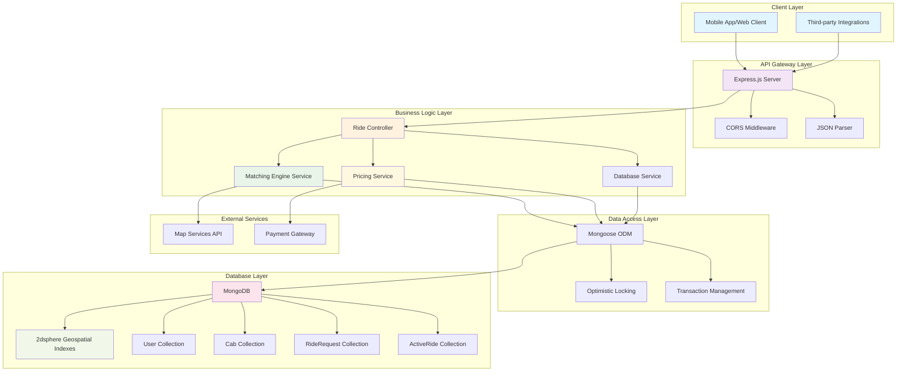
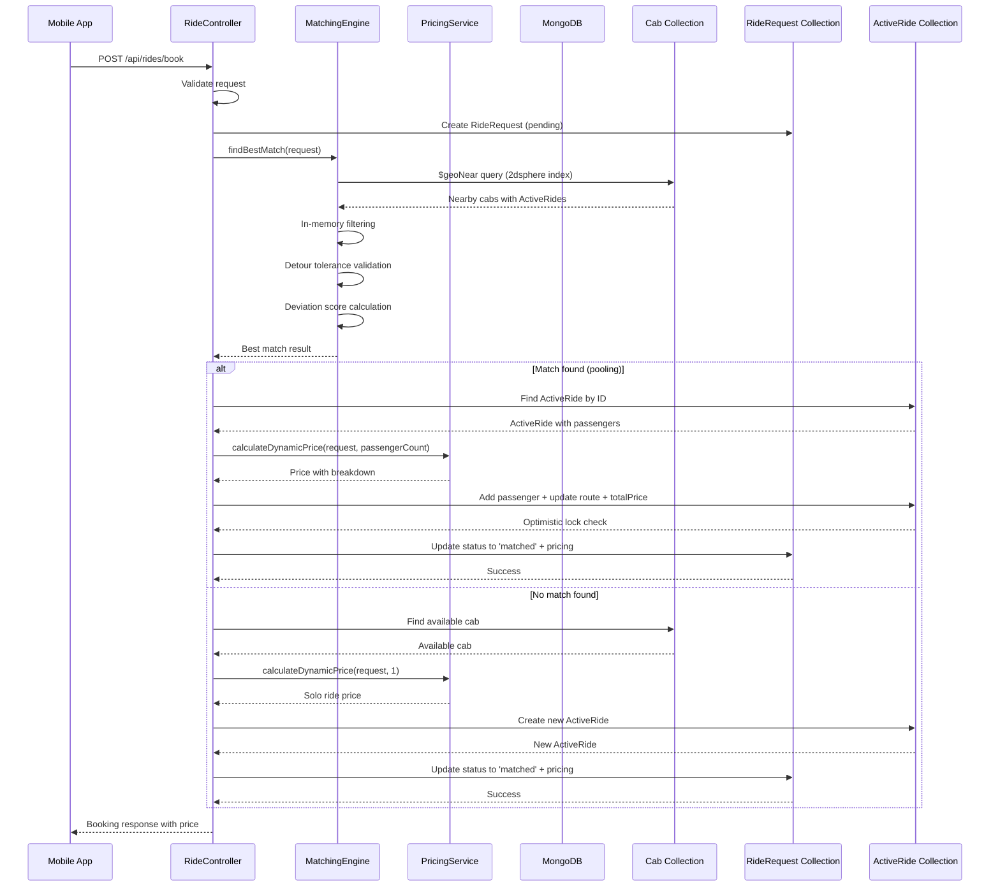
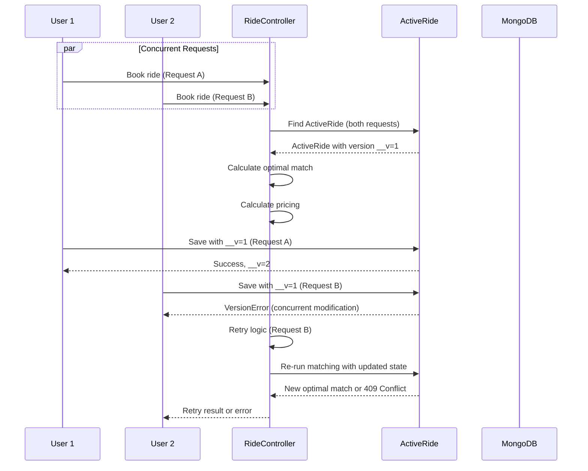

# Smart Airport Ride Pooling System Design

## Overview

This document provides comprehensive system design documentation for the Smart Airport Ride Pooling Backend, covering both high-level architecture and low-level entity relationships.

## Table of Contents

1. [High-Level Architecture (HLD)](#high-level-architecture-hld)
2. [Low-Level Design (LLD)](#low-level-design-lld)
3. [Data Flow](#data-flow)
4. [Key Design Decisions](#key-design-decisions)

---

## High-Level Architecture (HLD)

The system follows a layered architecture with clear separation of concerns, optimized for high-performance geospatial queries and concurrent ride matching.



### Architecture Components

#### **Client Layer**
- **Mobile App/Web Client**: Primary user interface for booking rides
- **Third-party Integrations**: External systems that may integrate with the ride pooling API

#### **API Gateway Layer**
- **Express.js Server**: Main web server handling HTTP requests
- **CORS Middleware**: Cross-origin resource sharing configuration
- **JSON Parser**: Request body parsing middleware

#### **Business Logic Layer**
- **Ride Controller**: Handles HTTP request/response lifecycle
- **Matching Engine Service**: Core DSA algorithm for ride matching
- **Pricing Service**: Dynamic pricing calculation with surge and pool discounts
- **Database Service**: Data access abstraction layer

#### **Data Access Layer**
- **Mongoose ODM**: Object Document Mapping for MongoDB
- **Optimistic Locking**: Concurrency control mechanism
- **Transaction Management**: ACID compliance for critical operations

#### **Database Layer**
- **MongoDB**: Primary database with geospatial capabilities
- **2dsphere Geospatial Indexes**: Optimized spatial queries for sub-300ms performance
- **Collections**: User, Cab, RideRequest, and ActiveRide entities

#### **External Services**
- **Map Services API**: External mapping and routing services
- **Payment Gateway**: Integration for payment processing

---

## Low-Level Design (LLD)

This section details the entity relationships and class structure of the system.

```mermaid
classDiagram
    class User {
        -_id: ObjectId
        -name: String
        -email: String
        -createdAt: Date
        -updatedAt: Date
        +validateEmail(): Boolean
        +toString(): String
    }
    
    class Cab {
        -_id: ObjectId
        -driverName: String
        -licensePlate: String
        -capacity: Number
        -currentLocation: GeoJSON Point
        -__v: Number (optimistic lock)
        -createdAt: Date
        -updatedAt: Date
        +isAvailable(passengerCount): Boolean
        +updateLocation(coordinates): Promise
        +validateCapacity(passengerCount): Boolean
    }
    
    class RideRequest {
        -_id: ObjectId
        -userId: ObjectId (ref: User)
        -pickupLocation: GeoJSON Point
        -dropoffLocation: GeoJSON Point
        -detourTolerance: Number
        -luggageCount: Number
        -status: String (pending|matched|completed|cancelled)
        -price: Number
        -pricingBreakdown: Object
        -createdAt: Date
        -updatedAt: Date
        +calculateDistance(): Number
        +validateDetour(): Boolean
        +updateStatus(newStatus): Promise
    }
    
    class ActiveRide {
        -_id: ObjectId
        -cabId: ObjectId (ref: Cab)
        -passengers: Array[Passenger]
        -currentRoute: GeoJSON LineString
        -status: String (active|completed|cancelled)
        -totalPrice: Number
        -__v: Number (optimistic lock)
        -createdAt: Date
        -updatedAt: Date
        +addPassenger(passenger): Promise
        +removePassenger(userId): Promise
        +recalculateRoute(): Array[Coordinates]
        +validateCapacity(): Boolean
        +calculateTotalLuggage(): Number
    }
    
    class Passenger {
        -userId: ObjectId (ref: User)
        -pickupLocation: GeoJSON Point
        -dropoffLocation: GeoJSON Point
        -luggageCount: Number
        +calculateIndividualDistance(): Number
        +validateDetour(): Boolean
    }
    
    class MatchingEngine {
        +findBestMatch(request: RideRequest): Promise~MatchResult~
        +calculateOptimalRoute(passengers, newRequest, cabLocation): Array[Coordinates]
        +validateDetourTolerance(passenger, newRequest, originalRoute, newRoute): Boolean
        +checkLuggageConstraint(passengers, newLuggageCount, cabCapacity): Boolean
        +calculateDeviationScore(passengers, newRequest, route): Number
    }
    
    class PricingService {
        +calculateDynamicPrice(pickup, dropoff, passengerCount): Promise~PriceResult~
        +calculateSurgeMultiplier(): Promise~Number~
        +calculatePoolDiscountFactor(passengerCount): Number
        +calculateDistance(coord1, coord2): Number
        +getMarketConditions(): Promise~MarketData~
    }
    
    class RideController {
        +bookRide(req, res): Promise
        +cancelRide(req, res): Promise
        +validateRequest(req): Object
        +handleConcurrencyError(error): Object
    }
    
    User ||--o{ RideRequest : "1 to many"
    User ||--o{ ActiveRide.passengers : "1 to many"
    Cab ||--|| ActiveRide : "1 to 1"
    RideRequest ||--|| ActiveRide : "1 to 1 (when matched)"
    ActiveRide }o-- Passenger : "contains"
    RideController --> MatchingEngine : "uses"
    RideController --> PricingService : "uses"
    MatchingEngine --> PricingService : "may use"
    
    style User fill:#e3f2fd
    style Cab fill:#e8f5e8
    style RideRequest fill:#fff3e0
    style ActiveRide fill:#fce4ec
    style MatchingEngine fill:#e1f5fe
    style PricingService fill:#f3e5f5
    style RideController fill:#fff8e1
```

### Entity Relationships

#### **User**
- **Primary Key**: `_id` (ObjectId)
- **Relationships**: 
  - One-to-many with `RideRequest`
  - One-to-many with `ActiveRide.passengers` (embedded)
- **Validation**: Email format validation, required fields

#### **Cab**
- **Primary Key**: `_id` (ObjectId)
- **Relationships**: 
  - One-to-one with `ActiveRide`
  - Optimistic locking with `__v` field
- **Geospatial**: `currentLocation` with 2dsphere index
- **Business Logic**: Capacity validation, availability checks

#### **RideRequest**
- **Primary Key**: `_id` (ObjectId)
- **Relationships**: 
  - Many-to-one with `User`
  - One-to-one with `ActiveRide` (when matched)
- **State Management**: Status transitions (pending → matched → completed/cancelled)
- **Pricing**: Stores calculated price and breakdown

#### **ActiveRide**
- **Primary Key**: `_id` (ObjectId)
- **Relationships**: 
  - One-to-one with `Cab`
  - Embedded array of `Passenger` objects
  - Optimistic locking with `__v` field
- **Geospatial**: `currentRoute` as GeoJSON LineString
- **Business Logic**: Dynamic route recalculation, capacity management

---

## Data Flow

### Ride Booking Flow



### Concurrency Handling Flow



---

## Key Design Decisions

### 1. **Database Choice: MongoDB**
- **Why**: Native geospatial support with 2dsphere indexes
- **Benefits**: Sub-300ms query performance, flexible schema for route data
- **Trade-offs**: Eventual consistency (mitigated with transactions)

### 2. **Optimistic Locking Strategy**
- **Why**: High concurrency scenarios with minimal blocking
- **Implementation**: Mongoose's built-in `__v` version field
- **Benefits**: Better performance than pessimistic locking for our use case
- **Fallback**: Retry mechanism with 3 attempts

### 3. **Geospatial Indexing**
- **Why**: Critical for sub-300ms matching performance
- **Implementation**: 2dsphere indexes on all location fields
- **Query Strategy**: MongoDB's `$geoNear` for initial filtering

### 4. **Embedded vs Referenced Data**
- **ActiveRide.passengers**: Embedded for performance (frequent access)
- **RideRequest.userId**: Referenced for data integrity
- **Decision**: Balance between query performance and data consistency

### 5. **Pricing Service Architecture**
- **Why**: Separation of concerns, testability
- **Components**: Surge detection, pool discount, distance calculation
- **Transparency**: Detailed breakdown returned to users

### 6. **Error Handling Strategy**
- **Validation**: Comprehensive input validation at controller level
- **Concurrency**: Optimistic locking with retry mechanism
- **Graceful Degradation**: 409 Conflict responses instead of system failures

### 7. **Transaction Management**
- **Scope**: Critical operations (booking, cancellation) wrapped in transactions
- **Benefits**: ACID compliance for financial operations
- **Performance**: Short-lived transactions to minimize lock contention

This design ensures the system can handle high-volume ride requests while maintaining data consistency, providing transparent pricing, and delivering sub-300ms response times for the core matching functionality.